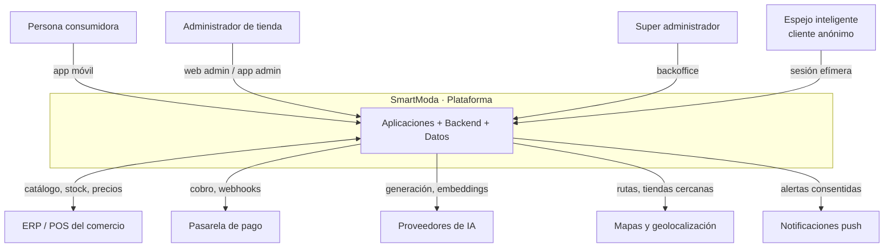
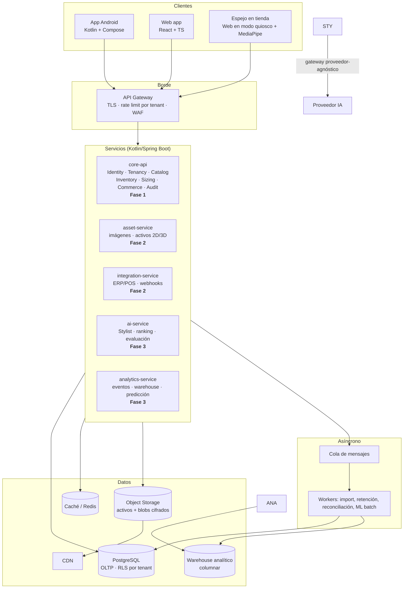

# 09 · Arquitectura de solución

## 0. Resumen ejecutivo

| Decisión | Elección | Por qué |
|---|---|---|
| Estilo arquitectónico | **Microservicios acotados: máximo 5, y cada uno aparece con su funcionalidad** | Decisión del sponsor. Se hace ejecutable con una sola persona limitando el número de servicios y difiriendo su aparición ([ADR-0012](adr/ADR-0012-microservicios-acotados.md), reemplaza a [ADR-0001](adr/ADR-0001-monolito-modular-vs-microservicios.md)) |
| Multi-tenancy | `tenant_id` desde el Sprint 0 + Row Level Security en PostgreSQL + contexto derivado del token | Añadirlo tarde es una reescritura ([ADR-0002](adr/ADR-0002-estrategia-multitenant.md)) |
| Datos corporales | **No salen del dispositivo.** Cifrado local en móvil; sincronización E2E opcional. En el espejo, sesión anónima en memoria | Elimina toda una clase de riesgo regulatorio ([ADR-0003](adr/ADR-0003-almacenamiento-perfil-corporal.md), [ADR-0011](adr/ADR-0011-espejo-inteligente-anonimo.md)) |
| Móvil | Kotlin + Jetpack Compose, Clean Architecture por capas, offline-first | Ya decidido en `D-04`, y es la elección correcta para AR y ML on-device |
| Web | React + TypeScript + Vite, cliente generado de OpenAPI | Ecosistema, velocidad, disponibilidad de talento |
| Backend | Kotlin/Spring Boot (Fase 2+), PostgreSQL, arquitectura hexagonal | Un solo lenguaje en móvil y servidor reduce el costo cognitivo del equipo |
| Fase 1 | Supabase + `core-api` detrás de una capa Repository | Costo casi cero con plan de salida escrito ([ADR-0004](adr/ADR-0004-backend-fase-1.md)). Con un servicio desplegado, USD 0–25/mes |
| Monetización | Publicidad **contextual** + licencia por negocio y sucursal | La segmentación publicitaria nunca usa datos corporales ([ADR-0014](adr/ADR-0014-monetizacion-publicidad.md)) |

---

## 1. Contexto del sistema (C4 nivel 1)



**Fronteras de confianza:** todo lo que está fuera de `SmartModa` es no confiable. El ERP del comercio y
los proveedores de IA se consumen a través de **adaptadores con contrato propio**, nunca acoplando el
dominio al formato del tercero.

---

## 2. Contenedores (C4 nivel 2)



### Por qué el módulo `TryOn` no procesa imágenes en el servidor

En Fase 1 y 2 la detección de pose, la generación de silueta y la composición 2D ocurren **en el
dispositivo** (ML Kit Pose on-device). El servidor solo entrega los activos de la prenda. Esto no es
una optimización: es el control que hace que RN-014 sea verificable con un capturador de tráfico.

---

## 3. Servicios y módulos

Cinco servicios como máximo ([ADR-0012](adr/ADR-0012-microservicios-acotados.md)). Dentro de cada uno,
módulos con arquitectura hexagonal. **Regla estructural:** un módulo solo puede depender de otro a
través de su paquete `api`, nunca de su `domain` ni de su `infra`. ArchUnit lo verifica en CI.

```
core-api  (Fase 1)                    asset-service        (Fase 2)
com.synaptia.smartmoda                integration-service  (Fase 2)
├── identity/                          ai-service           (Fase 3)
├── tenancy/                           analytics-service    (Fase 3)
├── catalog/
├── inventory/                         shared-domain  (biblioteca, no servicio)
├── sizing/                              tipos, políticas de talla, TenantId
├── tryon/                               Kotlin puro → corre en móvil, servidor y web
├── commerce/
├── audit/
└── shared/
```

**`core-api` no se fragmenta.** Catalog, Inventory, Sizing y Commerce comparten transacciones y
exigen consistencia inmediata (RN-003). Separarlos convierte "reservar una prenda" en una saga
distribuida sin ningún beneficio a este volumen. Es el error que hunde proyectos de microservicios con
equipos pequeños.

| Módulo | Responsabilidad | Datos propios | Publica eventos |
|---|---|---|---|
| `identity` | Usuarios, autenticación, roles, sesiones, MFA | `users`, `role_assignments`, `sessions` | `UserRegistered`, `RoleGranted` |
| `tenancy` | Tenants, planes, cuotas, tema visual, feature flags | `tenants`, `plans`, `themes`, `features` | `TenantProvisioned`, `ThemePublished` |
| `catalog` | Productos, variantes, activos, taxonomía, tablas de tallas | `products`, `variants`, `assets`, `size_charts` | `ProductPublished`, `PriceChanged` |
| `inventory` | Stock por tienda, ubicaciones, reservas, integración ERP | `stock`, `store_locations`, `reservations` | `StockChanged`, `StockDepleted` |
| `sizing` | Cálculo de talla, confianza, explicación | (solo lee `size_charts`) | `SizeRecommended` |
| `tryon` | Sesiones de prueba, perfiles de activo, blobs cifrados | `try_on_sessions`, `asset_profiles` | `TryOnCompleted` |
| `styling` | Stylist IA, outfits, gateway y evaluación de modelos | `outfits`, `ai_requests`, `evaluations` | `OutfitGenerated` |
| `commerce` | Carrito, reservas, órdenes, pagos, devoluciones | `carts`, `orders`, `payments` | `OrderPlaced`, `OrderReturned` |
| `analytics` | Ingesta y validación de eventos, agregados, modelos | `events_raw`, `events_valid` → warehouse | — |
| `audit` | Registro append-only, integridad, consulta | `audit_log` (particionado) | — |

### Comunicación entre módulos

- **Consulta:** llamada directa a la interfaz `api` del otro módulo (en proceso, sin red).
- **Reacción:** evento de dominio publicado en un bus interno. Si el módulo se extrae luego, el
  mismo evento pasa a la cola sin cambiar el productor ni el consumidor.
- **Prohibido:** que `commerce` haga `SELECT` sobre las tablas de `catalog`. Rompe la costura y
  hace imposible la extracción posterior. ArchUnit lo verifica.

---

## 4. Arquitectura de la aplicación Android

```
app/                    navegación, DI, tema, splash
├── core/
│   ├── designsystem/   componentes y tokens generados (EN-1903)
│   ├── network/        cliente OpenAPI, interceptores, auth
│   ├── database/       Room cifrado (SQLCipher), DAO
│   ├── crypto/         Keystore, cifrado E2E del perfil (EN-0207)
│   ├── ml/             abstracción de pose (fachada sobre ML Kit)
│   └── common/         Result, dispatchers, utilidades
└── feature/
    ├── onboarding/  auth/  profile/  measurements/  avatar/
    ├── catalog/  sizing/  tryon2d/  tryonar/  stylist/
    ├── closet/  commerce/  settings/  admin/
```

**Capas dentro de cada feature** (Clean Architecture):

```
ui (Compose)  →  ViewModel (StateFlow, UiState inmutable)
                     ↓
              UseCase (dominio puro, sin Android)
                     ↓
              Repository (interfaz en dominio, impl en data)
                     ↓
        DataSource local (Room)  +  DataSource remoto (API)
```

Reglas:

- **Offline-first**: el repositorio es la única fuente de verdad; la UI observa la base local, la red
  es un mecanismo de actualización, no la fuente. Sin esto, RNF-07 no se cumple.
- **El dominio no conoce Android**: los módulos `domain` compilan como Kotlin puro (JVM). Eso hace que
  sus pruebas sean rápidas y que la lógica sea reutilizable en el backend.
- **`UiState` es un `data class` inmutable** con estados explícitos (`Loading`, `Content`, `Empty`,
  `Error`). Nada de banderas booleanas sueltas.
- **La abstracción de ML es obligatoria**: `PoseDetector` es una interfaz nuestra. ML Kit Pose está en
  beta y puede cambiar (riesgo `R-05`); la abstracción es el seguro.

---

## 5. Arquitectura de la aplicación web

```
src/
├── app/            rutas, providers, guardas de rol
├── shared/
│   ├── api/        cliente generado de OpenAPI (no editado a mano)
│   ├── ui/          design system web (tokens de EN-1903)
│   ├── auth/        sesión, refresh, step-up MFA
│   └── tenant/      contexto de tenant y tema activo
└── features/
    ├── catalog-admin/  inventory-admin/  assets/  sizing-admin/
    ├── analytics/  audit/  settings/
    ├── platform/       (solo roles PLATFORM_*: tenants, temas, features, salud)
    └── mirror/         espejo en tienda: modo quiosco, medición anónima (US-1406, US-1407)
```

- **Feature-sliced**: cada feature contiene su UI, su estado y sus llamadas. Sin carpeta global de
  `components` que se convierta en vertedero.
- **El tema del tenant se resuelve antes de la primera pintura** (variables CSS inyectadas en el HTML
  del servidor o en un script de arranque), para cumplir el criterio de "sin parpadeo de tema".
- **Rutas guardadas por rol**: la guarda del cliente es usabilidad, no seguridad. La autorización real
  está en el servidor, siempre.

---

## 6. Patrones de diseño aplicados

Patrones usados donde resuelven un problema concreto, no por catálogo:

| Patrón | Dónde | Problema que resuelve |
|---|---|---|
| **Repository** | Móvil y backend | Aislar el origen de datos para poder migrar de BaaS a backend propio sin tocar el dominio (riesgo `R-14`) |
| **Hexagonal / Ports & Adapters** | Backend, por módulo | El dominio no depende de Spring, del ORM ni del proveedor de IA |
| **Strategy** | `SizeRecommendationPolicy`, `PoseDetector`, `AiProvider` | Cambiar algoritmo de talla, proveedor de pose o modelo de IA sin tocar quien los usa |
| **Adapter** | Integraciones ERP/POS, pasarelas | Cada ERP habla distinto; el dominio habla uno solo |
| **Factory** | Construcción de avatar según capacidades del dispositivo | Silueta 2D / paramétrico / AR según lo que el dispositivo soporte |
| **Observer / Flow** | Estado de UI, cambios de stock | Reactividad sin polling |
| **Outbox** | Eventos de dominio que deben sobrevivir al commit | Publicar un evento y persistir en la misma transacción, sin dos-fases |
| **Saga con compensación** | Aprovisionamiento de tenant, orden de compra | Procesos multipaso que pueden fallar a la mitad |
| **Circuit Breaker + Retry con backoff** | Llamadas a IA, ERP, pasarela | Un tercero lento no puede tumbar el sistema |
| **Idempotency Key** | Pagos, reservas, webhooks, importaciones | RN-010 |
| **Specification** | Filtros de catálogo y de recomendación | Componer reglas de negocio sin `if` anidados |
| **Decorator** | Auditoría, métricas, caché sobre casos de uso | Transversales sin ensuciar el dominio |
| **Feature Toggle** | Despliegue progresivo, funciones por tenant | `EN-0007`, `US-1705` |
| **Anti-corruption Layer** | Frontera con ERP y con proveedores de IA | Que el modelo ajeno no contamine el nuestro |

**Patrones que deliberadamente NO usamos en Fase 1:** CQRS con almacenes separados, Event Sourcing,
Service Mesh. Resuelven problemas de escala que aún no existen y cuestan mantenimiento desde el día uno.

---

## 7. Código limpio: reglas verificables

No sirve escribir "código limpio" como aspiración. Estas reglas son gates de CI:

| Regla | Verificación |
|---|---|
| Sin dependencias entre `domain` de módulos distintos | ArchUnit / Konsist |
| El `domain` no importa Spring, Android ni Jackson | ArchUnit |
| Métodos ≤ 40 líneas, clases ≤ 400, complejidad ciclomática ≤ 10 | Detekt / ktlint |
| Nombres del glosario ([doc 02](02-glosario.md)) en entidades y eventos | Revisión + lista de términos prohibidos en lint |
| Sin `!!` en Kotlin fuera de tests | Detekt |
| Sin `TODO` sin ticket asociado | Lint personalizado |
| Sin literales mágicos en reglas de negocio | Detekt (`MagicNumber`) |
| Sin `catch (e: Exception)` genérico en dominio | Detekt |
| Cobertura del dominio ≥ 85% | Gate de Jacoco |
| Toda regla `RN-xxx` tiene un test cuyo nombre la referencia | Script de trazabilidad en CI |
| 0 secretos en el repositorio | Gitleaks |

---

## 8. Cuándo aparece cada servicio

Un servicio se despliega cuando existe la funcionalidad que justifica su ciclo de vida propio. No
antes: cinco servicios vacíos son cinco cosas que operar sin nada que hacer.

| Servicio | Aparece en | Lo justifica |
|---|---|---|
| **`core-api`** | Fase 1, Sprint 0 | Es el producto |
| **`asset-service`** | Fase 2, Sprint 7–8 | Llega el pipeline de activos; trabajo intensivo dirigido por cola, distinto del perfil de la API |
| **`integration-service`** | Fase 2, Sprint 12 o antes si aparece un comercio con ERP | **Es el que materializa el objetivo de integrar aplicaciones externas**: cada adaptador nuevo se despliega sin tocar el núcleo |
| **`ai-service`** | Fase 3, Sprint 14 | Modelos y prompts cambian semanalmente; el catálogo no |
| **`analytics-service`** | Fase 3, Sprint 19 | Escritura masiva de eventos frente a lectura transaccional |

Requisitos para todos, desde el primero:

- Contrato OpenAPI propio y versionado; clientes generados (`AUT-05`).
- Base de datos propia. Ningún servicio lee las tablas de otro.
- Comunicación asíncrona por defecto; síncrona solo si el usuario espera la respuesta.
- `tenant_id` derivado del token **en todos** (RN-009). Un fallo de aislamiento en cualquiera es un
  fallo de la plataforma.
- Trazas distribuidas con `trace_id` propagado desde el primer servicio.
- **Una sola plantilla de CI/CD reutilizada.** El costo operativo crece con el número de pipelines
  *distintos*, no de servicios. Es lo que hace esto sostenible con una persona.

---

## 9. Vista de despliegue

### Fase 1 — costo cero
```
Play Store (beta) ──► App Android
                          │
                          ▼
              BaaS gratuito (Firebase / Supabase)
              Auth · Firestore/Postgres · Storage · Functions
                          │
                          ▼
              GitHub Actions (CI/CD, minutos gratuitos)
```

### Fase 2 — backend propio
```
CDN ──► Web (hosting estático gratuito o de bajo costo)
             │
             ▼
      API Gateway / Ingress
             │
             ▼
      Backend Spring Boot (contenedor, 1–2 réplicas)
             │
      ┌──────┴──────┐
      ▼             ▼
 PostgreSQL     Object Storage
 (gestionado)    (activos)
```

### Fase 3 — SaaS
```
CDN + WAF
     │
API Gateway (rate limit por tenant, autenticación en el borde)
     │
Backend (N réplicas, autoescalado)  ──►  Cola  ──►  Workers
     │                                                 │
PostgreSQL (primaria + réplica de lectura + PITR)      │
     │                                                 ▼
     └──────────────────────────────────────►  Warehouse analítico
                                                       │
                                            Servicios extraídos:
                                            Styling · Analytics · Assets
```

---

## 10. Decisiones transversales

### Contrato antes que código
El `openapi.yaml` es la fuente de verdad de la API. Los clientes de Android y web se **generan**; nadie
escribe un DTO a mano. Un cambio incompatible rompe la compilación de los clientes en CI (`AUT-05`).

### Versionado de la API
`/v1/...` en la ruta. Los cambios compatibles no incrementan versión. Los incompatibles obligan a
convivencia de `v1` y `v2` durante al menos un ciclo de release de la app móvil, porque un usuario
puede tardar semanas en actualizar.

### Idempotencia
Todo `POST` que produzca un efecto de negocio acepta `Idempotency-Key`. El servidor almacena la
respuesta durante 24 h y la devuelve idéntica ante la repetición.

### Errores
Formato único (`RFC 7807 Problem Details`) con `type`, `title`, `status`, `detail`, `instance` y
`trace_id`. El `detail` es apto para mostrar al usuario; nunca contiene información interna.

### Trazabilidad
`trace_id` generado en el borde, propagado a todos los módulos, presente en cada log y devuelto en
cada respuesta de error. Un usuario que reporta un problema da un código; con él se reconstruye todo.
