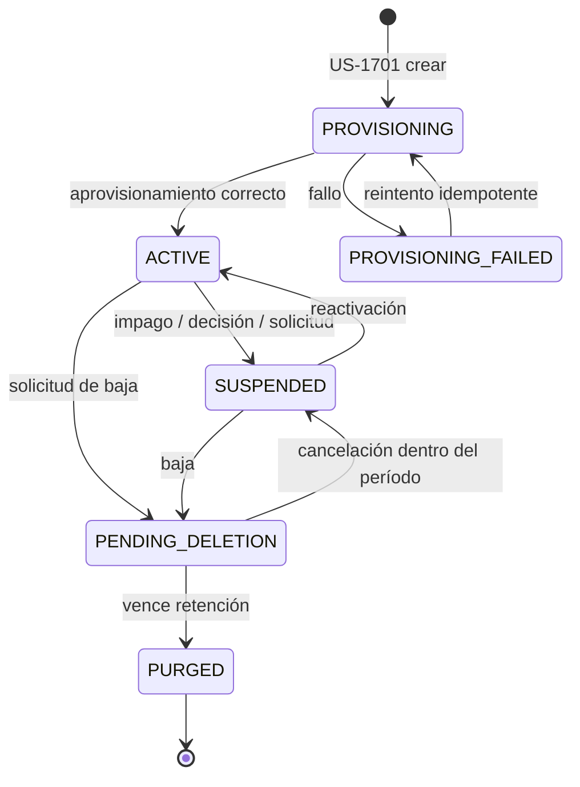

# 10 · Multi-tenancy

## 1. Qué significa "multi-tenant" en este producto

Tres cosas distintas que suelen confundirse:

| Dimensión | Qué significa aquí | Cuándo se implementa |
|---|---|---|
| **Aislamiento de datos** | Los datos de la empresa A son inaccesibles para la empresa B, por diseño y verificado por prueba | Modelo desde Sprint 0, RLS desde Fase 2, verificación desde Sprint 17 |
| **Personalización** | Cada empresa ve la aplicación con su marca, sus funciones y sus reglas | Fase 3 (US-1703, US-1705) |
| **Operación independiente** | Planes, cuotas, facturación y ciclo de vida por empresa | Fase 3 (US-1603, US-1701) |

El error costoso es tratar la primera como si fuera de Fase 3. **No lo es.**

---

## 2. Estrategia de aislamiento

### Modelo elegido: base de datos compartida, esquema compartido, `tenant_id` + Row Level Security

| Modelo | Aislamiento | Costo | Operación | Veredicto |
|---|---|---|---|---|
| Base por tenant | Máximo | Muy alto | Migraciones × N bases | Solo para clientes empresariales que lo exijan y lo paguen |
| Esquema por tenant | Alto | Medio-alto | Migraciones × N esquemas; límite práctico ~500 | Descartado por complejidad operativa |
| **Fila compartida + `tenant_id` + RLS** | **Alto si se hace bien** | **Bajo** | **Una migración** | **Elegido** |

La objeción legítima al modelo compartido es "un `WHERE` olvidado filtra datos". Se responde con
**tres capas independientes**, no con disciplina:

```
Capa 1 · Aplicación   TenantContext derivado del token; el repositorio base
                      inyecta el filtro. Nadie escribe el WHERE a mano.

Capa 2 · Base datos   Row Level Security de PostgreSQL con
                      current_setting('app.tenant_id'). Aunque la aplicación
                      olvide el filtro, la base no devuelve la fila.

Capa 3 · Pruebas      Suite negativa obligatoria: para CADA endpoint,
                      token de A + recurso de B ⇒ 404. Falla el build si falta.
```

Si las tres capas fallan a la vez, el problema no es el modelo.

### Row Level Security

```sql
ALTER TABLE product ENABLE ROW LEVEL SECURITY;
ALTER TABLE product FORCE ROW LEVEL SECURITY;   -- aplica también al dueño

CREATE POLICY tenant_isolation ON product
  USING (tenant_id = current_setting('app.tenant_id')::uuid)
  WITH CHECK (tenant_id = current_setting('app.tenant_id')::uuid);
```

`FORCE` es indispensable: sin él, el rol propietario de la tabla ignora la política, y ese es
justamente el rol con el que suelen correr las aplicaciones mal configuradas.

El `SET LOCAL app.tenant_id` se ejecuta al abrir la transacción, desde un interceptor único. Si el
contexto no está establecido, la política no coincide con nada y la consulta devuelve cero filas —
**falla cerrado**, que es el comportamiento correcto.

### Derivación del contexto (RN-009)

```
Petición ──► Gateway valida el token
         ──► Se extrae user_id
         ──► Se resuelven las asignaciones de rol del usuario
         ──► El tenant activo se toma de la asignación,
             NUNCA de un encabezado o parámetro del cliente
         ──► Si el usuario tiene varios, el cliente indica CUÁL de los suyos,
             y el servidor verifica que le pertenece
         ──► SET LOCAL app.tenant_id
```

Un `tenant_id` en el cuerpo o en la URL que no coincida con el derivado produce `404`.
**`404` y no `403`**: un `403` confirma que el recurso existe, y eso ya es una fuga.

---

## 3. Tablas y su relación con el tenant

| Tipo | Ejemplos | `tenant_id` | RLS |
|---|---|---|---|
| **Por tenant** | `product`, `variant`, `stock`, `store`, `size_chart`, `order`, `theme`, `audit_log` | Obligatorio, `NOT NULL` | Sí |
| **Globales de plataforma** | `plan`, `feature_catalog`, `canonical_color`, `country`, `platform_user` | No aplica | No |
| **De usuario final** | `user`, `body_profile_blob`, `favorite`, `try_on_session` | **No** — el usuario pertenece a la plataforma, no a una empresa | Políticas por `user_id` |
| **Puente** | `user_tenant_interaction` (qué usuario vio/probó/compró de qué tenant) | Sí | Sí |

> **Decisión de fondo:** el usuario consumidor **no pertenece a un tenant**. Se registra una vez y
> puede comprar en muchas tiendas, como en cualquier marketplace. Lo que sí pertenece al tenant es la
> *interacción* de ese usuario con su catálogo. Esto tiene una consecuencia importante: una empresa
> **nunca** ve la lista de usuarios de la plataforma, solo agregados de quienes interactuaron con ella
> (con umbral mínimo de 30 para evitar reidentificación).

---

## 4. Personalización por tenant

### Qué es configurable

| Categoría | Elementos | Historia |
|---|---|---|
| **Identidad visual** | Logo (claro/oscuro), color de acento, color secundario, tipografía, radio de esquina, densidad, imagen de splash | US-1703 |
| **Movimiento** | Preajuste de animación, duración y curva de transiciones | US-1704 |
| **Funcionalidad** | Qué módulos ve el tenant: AR, Stylist IA, kiosco, pago integrado, reservas, cupones | US-1705 |
| **Negocio** | Moneda, sistema de tallas, unidades por defecto, política de devolución, umbral de stock bajo | US-1207 |
| **Taxonomía** | Categorías, colores comerciales, materiales, atributos propios | US-0413 |
| **Organización** | Marcas, tiendas, secciones, ubicaciones | US-0410 |

### Qué NO es configurable (y por qué)

| No configurable | Razón |
|---|---|
| Paleta de navegación, carrito y pago | RN-027: el usuario debe reconocer dónde está la plataforma y dónde la marca |
| Auditoría | Es un control, no una función |
| MFA de roles administrativos | Idem |
| Aislamiento entre tenants | Idem |
| Textos legales de consentimiento | Responsabilidad regulatoria de la plataforma |
| Combinaciones de color que incumplen WCAG AA | RN-026: la accesibilidad no es opcional |

### Cómo se aplica el tema

```
Tema publicado (versionado)
   └─► Se genera un bundle de tokens (JSON) por tenant
        ├─► Web: variables CSS inyectadas antes de la primera pintura
        ├─► Android: ThemeOverride cargado antes del primer frame,
        │            cacheado localmente; sin caché usa el tema por defecto
        └─► Kiosco: igual que Android, con recarga al inicio de cada sesión
```

El bundle se sirve por CDN con hash en el nombre, así que un cambio de tema es una invalidación de
caché, no un despliegue. Requisito: propagación ≤ 5 minutos (US-1703 CA-5).

---

## 5. Cuotas y límites por plan

| Recurso | Límite típico | Comportamiento al superarlo |
|---|---|---|
| SKU publicados | Por plan | Bloquea publicar nuevos; los existentes siguen activos |
| Tiendas | Por plan | Bloquea crear nuevas |
| Usuarios administrativos | Por plan | Bloquea invitar nuevos |
| Pruebas virtuales/mes | Por plan | **Degrada**: mantiene 2D, desactiva AR; nunca corta el catálogo |
| Consultas al Stylist IA/mes | Por plan | Desactiva el Stylist con aviso; el resto sigue |
| Almacenamiento de activos | Por plan | Bloquea subir nuevos activos |
| Peticiones a la API/min | Por plan | `429` con `Retry-After` |

Reglas:
- Aviso al **80%** al propietario del tenant y al equipo comercial.
- Al **100%**, la política del plan decide: degradar (por defecto) o bloquear.
- **Nunca** pérdida de datos por superar una cuota (RN-028).
- El límite de tasa se aplica en el **borde**, por tenant, antes de tocar la aplicación.

---

## 6. Ciclo de vida de un tenant



En `PURGED` se conservan únicamente facturación y auditoría por exigencia legal (US-1702 CA-5,
EN-1804 CA-5). Todo lo demás se elimina y se emite certificado de borrado.

---

## 7. Pruebas obligatorias de aislamiento

Sin estas pruebas, el aislamiento es una intención:

| Prueba | Qué verifica |
|---|---|
| **Barrido de endpoints** | Para *cada* endpoint del OpenAPI: token de A + recurso de B ⇒ `404`. Se genera automáticamente desde el contrato; un endpoint nuevo sin prueba rompe el build |
| **RLS activo** | Consulta directa a la base sin `app.tenant_id` establecido ⇒ 0 filas en toda tabla con `tenant_id` |
| **Cobertura de columna** | Toda tabla nueva con datos de negocio tiene `tenant_id NOT NULL` y política RLS. Un script de migración lo verifica |
| **Fuga en agregados** | Un tenant con menos de 30 usuarios en un segmento no puede obtener el detalle (US-1306 CA-4) |
| **Fuga por caché** | Cambiar de contexto invalida la caché: 0 datos del contexto anterior (US-0107 CA-4) |
| **Fuga por búsqueda** | Índices de búsqueda de texto y de embeddings filtrados por tenant |
| **Fuga por activos** | URL firmada de un activo de A no sirve autenticado como B |
| **Fuga por evento** | Un webhook o notificación de A nunca llega a un endpoint de B |
| **Pentest** | `EN-1507`: aislamiento multi-tenant como objetivo explícito del alcance |

El riesgo `R-11` (fallo de aislamiento) está clasificado como **crítico** con razón: es el único fallo
de este sistema que termina un negocio SaaS de un día para otro.

---

## 8. Onboarding de una empresa (flujo objetivo: < 15 min)

```
1. Super admin crea el tenant (US-1701)               ~2 min
2. El propietario acepta la invitación y configura MFA ~3 min
3. Configura marca, tienda(s) y taxonomía mínima       ~3 min
   (o acepta los valores por defecto)
4. Importa el catálogo por archivo (US-0412)           ~5 min
   con validación en seco y corrección de errores
5. Sube o valida activos y tablas de tallas
6. Publica ⇒ el catálogo aparece en la app             inmediato
```

En el autoservicio (US-1605) los pasos 1 y 2 los hace el propio comercio; la plataforma solo aprueba.
Si un paso de este flujo requiere que alguien de ingeniería toque algo, el paso está mal diseñado.
