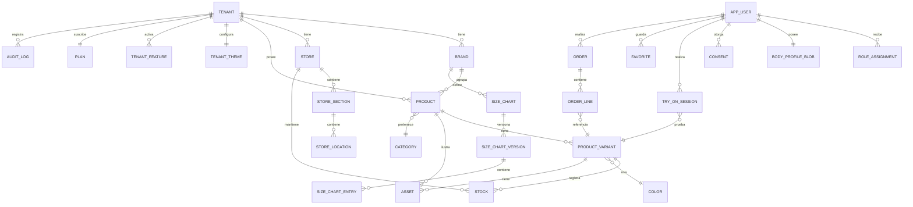

# 11 · Modelo de datos

Modelo conceptual y DDL de referencia para PostgreSQL (Fase 2+). En Fase 1 la estructura lógica es la
misma sobre el BaaS; la capa Repository la abstrae ([ADR-0004](adr/ADR-0004-backend-fase-1.md)).

**Convenciones:**
- Claves primarias `uuid` v7 (ordenables por tiempo, sin exponer conteo).
- Toda tabla de negocio: `tenant_id`, `created_at`, `updated_at`, `created_by`, `updated_by`, `version`.
- Nombres en inglés y singular. Los términos son los del [glosario](02-glosario.md).
- Marcas de tiempo `timestamptz` en UTC. Sin excepciones.
- Dinero como `numeric(14,2)` + `currency char(3)`. Nunca `float`.
- Medidas como `numeric(6,2)` en **milímetros**, y se presentan en cm o pulgadas.
- Borrado lógico (`deleted_at`) solo donde el negocio lo exige; el resto borra de verdad.

---

## 1. Mapa de entidades



---

## 2. Tenancy y configuración

```sql
CREATE TABLE tenant (
    id              uuid PRIMARY KEY,
    legal_name      text        NOT NULL,
    display_name    text        NOT NULL,
    tax_id          text        NOT NULL,
    country_code    char(2)     NOT NULL,
    currency        char(3)     NOT NULL,
    subdomain       citext      NOT NULL UNIQUE,
    plan_id         uuid        NOT NULL REFERENCES plan(id),
    status          text        NOT NULL
        CHECK (status IN ('PROVISIONING','PROVISIONING_FAILED','ACTIVE',
                          'SUSPENDED','PENDING_DELETION','PURGED')),
    purge_after     timestamptz,
    created_at      timestamptz NOT NULL DEFAULT now(),
    updated_at      timestamptz NOT NULL DEFAULT now(),
    UNIQUE (country_code, tax_id)
);

-- Tema visual versionado (US-1703). Nunca se sobrescribe: se publica una versión nueva.
CREATE TABLE tenant_theme (
    id              uuid PRIMARY KEY,
    tenant_id       uuid        NOT NULL REFERENCES tenant(id),
    version         int         NOT NULL,
    tokens          jsonb       NOT NULL,   -- colores, tipografía, radios, densidad
    motion          jsonb       NOT NULL,   -- preajuste de animación (US-1704)
    logo_light_url  text,
    logo_dark_url   text,
    wcag_report     jsonb       NOT NULL,   -- evidencia de contraste calculado
    published_at    timestamptz,
    published_by    uuid,
    UNIQUE (tenant_id, version)
);

CREATE TABLE tenant_feature (
    tenant_id       uuid        NOT NULL REFERENCES tenant(id),
    feature_key     text        NOT NULL REFERENCES feature_catalog(key),
    enabled         boolean     NOT NULL,
    is_exception    boolean     NOT NULL DEFAULT false,  -- fuera del plan
    justification   text,
    expires_at      timestamptz,
    PRIMARY KEY (tenant_id, feature_key)
);

CREATE TABLE plan (
    id              uuid PRIMARY KEY,
    key             text NOT NULL UNIQUE,
    display_name    text NOT NULL,
    price_monthly   numeric(14,2) NOT NULL,
    currency        char(3) NOT NULL,
    quotas          jsonb NOT NULL   -- {max_skus, max_stores, tryons_month, ai_calls_month, storage_mb}
);
```

---

## 3. Organización comercial

```sql
CREATE TABLE brand (
    id          uuid PRIMARY KEY,
    tenant_id   uuid NOT NULL REFERENCES tenant(id),
    name        text NOT NULL,
    slug        citext NOT NULL,
    logo_url    text,
    UNIQUE (tenant_id, slug)
);

CREATE TABLE store (
    id              uuid PRIMARY KEY,
    tenant_id       uuid NOT NULL REFERENCES tenant(id),
    brand_id        uuid REFERENCES brand(id),
    code            text NOT NULL,
    name            text NOT NULL,
    address         text,
    city            text,
    geo             geography(Point,4326),
    opening_hours   jsonb,
    allows_reserve  boolean NOT NULL DEFAULT false,
    allows_pickup   boolean NOT NULL DEFAULT false,
    is_active       boolean NOT NULL DEFAULT true,
    UNIQUE (tenant_id, code)
);

CREATE TABLE store_section (
    id          uuid PRIMARY KEY,
    tenant_id   uuid NOT NULL,
    store_id    uuid NOT NULL REFERENCES store(id),
    name        text NOT NULL,      -- "Hombre", "Deportivo"
    floor       text,               -- "1", "Sótano"
    sort_order  int  NOT NULL DEFAULT 0
);

-- Dónde está físicamente un SKU (US-0411)
CREATE TABLE store_location (
    id          uuid PRIMARY KEY,
    tenant_id   uuid NOT NULL,
    section_id  uuid NOT NULL REFERENCES store_section(id),
    label       text NOT NULL,      -- "Percha 12", "Góndola B"
    map_hint    text                -- descripción textual para el usuario
);
```

---

## 4. Catálogo

```sql
CREATE TABLE category (
    id          uuid PRIMARY KEY,
    tenant_id   uuid,               -- NULL = categoría canónica de plataforma
    parent_id   uuid REFERENCES category(id),
    name        text NOT NULL,
    canonical_key text,             -- mapeo a la taxonomía canónica
    level       int  NOT NULL CHECK (level BETWEEN 1 AND 3)
);

CREATE TABLE color (
    id            uuid PRIMARY KEY,
    tenant_id     uuid,             -- NULL = color canónico de plataforma
    name          text NOT NULL,    -- "Azul petróleo"
    hex           char(7) NOT NULL,
    canonical_id  uuid REFERENCES color(id)   -- US-0413 CA-3
);

CREATE TABLE product (
    id              uuid PRIMARY KEY,
    tenant_id       uuid NOT NULL REFERENCES tenant(id),
    brand_id        uuid NOT NULL REFERENCES brand(id),
    category_id     uuid NOT NULL REFERENCES category(id),
    reference_code  text NOT NULL,          -- código interno del comercio
    name            text NOT NULL,
    description     text,
    gender          text CHECK (gender IN ('MEN','WOMEN','UNISEX','KIDS')),
    material        text,
    season          text,
    attributes      jsonb NOT NULL DEFAULT '{}',   -- atributos propios (US-0413)
    status          text NOT NULL
        CHECK (status IN ('DRAFT','PUBLISHED','UNPUBLISHED','ARCHIVED')),
    published_at    timestamptz,
    created_at      timestamptz NOT NULL DEFAULT now(),
    updated_at      timestamptz NOT NULL DEFAULT now(),
    UNIQUE (tenant_id, brand_id, reference_code)
);

CREATE TABLE product_variant (
    id              uuid PRIMARY KEY,
    tenant_id       uuid NOT NULL,
    product_id      uuid NOT NULL REFERENCES product(id) ON DELETE CASCADE,
    sku             text NOT NULL,
    color_id        uuid REFERENCES color(id),
    size_label      text NOT NULL,          -- "M", "38", "L/32"
    size_system     char(2),                -- CO, EU, US, UK
    barcode         text,
    price           numeric(14,2) NOT NULL,
    compare_price   numeric(14,2),
    currency        char(3) NOT NULL,
    is_active       boolean NOT NULL DEFAULT true,
    UNIQUE (tenant_id, sku)
);

CREATE TABLE asset (
    id              uuid PRIMARY KEY,
    tenant_id       uuid NOT NULL,
    product_id      uuid REFERENCES product(id) ON DELETE CASCADE,
    variant_id      uuid REFERENCES product_variant(id) ON DELETE CASCADE,
    kind            text NOT NULL
        CHECK (kind IN ('PHOTO','FLAT_2D','MODEL_3D','TEXTURE','VIDEO')),
    storage_key     text NOT NULL,
    mime_type       text NOT NULL,
    width           int, height int, bytes bigint,
    -- perfil de activo validado; sin esto la prenda no entra a AR (RN-018)
    asset_profile   jsonb,
    profile_status  text NOT NULL DEFAULT 'PENDING'
        CHECK (profile_status IN ('PENDING','VALID','INVALID')),
    sort_order      int NOT NULL DEFAULT 0,
    CHECK (product_id IS NOT NULL OR variant_id IS NOT NULL)
);
```

### Tablas de tallas versionadas (RN-001, RN-015)

```sql
CREATE TABLE size_chart (
    id          uuid PRIMARY KEY,
    tenant_id   uuid NOT NULL,
    brand_id    uuid NOT NULL REFERENCES brand(id),
    category_id uuid NOT NULL REFERENCES category(id),
    gender      text NOT NULL,
    size_system char(2) NOT NULL,
    name        text NOT NULL
);

CREATE TABLE size_chart_version (
    id              uuid PRIMARY KEY,
    size_chart_id   uuid NOT NULL REFERENCES size_chart(id),
    version         int  NOT NULL,
    source          text NOT NULL,        -- de dónde salió la tabla
    effective_from  timestamptz NOT NULL,
    is_active       boolean NOT NULL,
    UNIQUE (size_chart_id, version)
);

CREATE TABLE size_chart_entry (
    id              uuid PRIMARY KEY,
    version_id      uuid NOT NULL REFERENCES size_chart_version(id) ON DELETE CASCADE,
    size_label      text NOT NULL,
    measurement_key text NOT NULL,        -- 'chest','waist','hip','inseam','shoulder'
    min_mm          numeric(6,2) NOT NULL,
    max_mm          numeric(6,2) NOT NULL,
    CHECK (min_mm < max_mm),
    UNIQUE (version_id, size_label, measurement_key)
);
```

> Una tabla de tallas **nunca se edita**: se publica una versión nueva. Toda recomendación guarda
> `size_chart_version_id`, así una recomendación de hace seis meses se puede reproducir exactamente.

---

## 5. Inventario

```sql
CREATE TABLE stock (
    tenant_id       uuid NOT NULL,
    variant_id      uuid NOT NULL REFERENCES product_variant(id) ON DELETE CASCADE,
    store_id        uuid NOT NULL REFERENCES store(id),
    location_id     uuid REFERENCES store_location(id),
    on_hand         int  NOT NULL DEFAULT 0 CHECK (on_hand >= 0),
    reserved        int  NOT NULL DEFAULT 0 CHECK (reserved >= 0),
    available       int  GENERATED ALWAYS AS (on_hand - reserved) STORED,
    updated_at      timestamptz NOT NULL DEFAULT now(),
    source          text NOT NULL DEFAULT 'MANUAL'
        CHECK (source IN ('MANUAL','IMPORT','ERP','POS','RECONCILIATION')),
    PRIMARY KEY (variant_id, store_id)
);

CREATE INDEX ON stock (tenant_id, store_id) WHERE available > 0;

-- Idempotencia de webhooks e importaciones (RN-010)
CREATE TABLE idempotency_record (
    key             text PRIMARY KEY,
    tenant_id       uuid NOT NULL,
    endpoint        text NOT NULL,
    request_hash    text NOT NULL,
    response_status int  NOT NULL,
    response_body   jsonb,
    created_at      timestamptz NOT NULL DEFAULT now(),
    expires_at      timestamptz NOT NULL
);

CREATE TABLE import_batch (
    id              uuid PRIMARY KEY,
    tenant_id       uuid NOT NULL,
    file_hash       text NOT NULL,
    mode            text NOT NULL CHECK (mode IN ('CREATE_ONLY','UPSERT','REPLACE')),
    status          text NOT NULL,
    total_rows      int, valid_rows int, error_rows int,
    report_key      text,             -- CSV de errores en object storage
    revertible_until timestamptz,     -- US-0412 CA-6
    created_by      uuid NOT NULL,
    created_at      timestamptz NOT NULL DEFAULT now()
);
```

---

## 6. Usuario, perfil corporal y consentimiento

```sql
-- El usuario consumidor NO pertenece a un tenant (ver doc 10 § 3)
CREATE TABLE app_user (
    id                  uuid PRIMARY KEY,
    email               citext UNIQUE,
    email_verified_at   timestamptz,
    password_hash       text,             -- Argon2id; NULL si solo usa federado
    display_name        text,
    locale              text NOT NULL DEFAULT 'es-CO',
    unit_system         text NOT NULL DEFAULT 'METRIC',
    is_adult            boolean NOT NULL, -- RN-022
    mfa_enrolled_at     timestamptz,
    status              text NOT NULL DEFAULT 'ACTIVE',
    created_at          timestamptz NOT NULL DEFAULT now(),
    deleted_at          timestamptz
);

-- El servidor almacena, NO descifra (RN-020, ADR-0003)
CREATE TABLE body_profile_blob (
    user_id         uuid PRIMARY KEY REFERENCES app_user(id) ON DELETE CASCADE,
    ciphertext      bytea       NOT NULL,
    nonce           bytea       NOT NULL,
    kdf_params      jsonb       NOT NULL,   -- parámetros públicos de derivación
    schema_version  int         NOT NULL,
    updated_at      timestamptz NOT NULL DEFAULT now(),
    device_count    int         NOT NULL DEFAULT 1
);
COMMENT ON TABLE body_profile_blob IS
  'Cifrado E2E. Ningun rol de plataforma puede descifrarlo. Prueba negativa: RN-020.';

CREATE TABLE consent (
    id              uuid PRIMARY KEY,
    user_id         uuid NOT NULL REFERENCES app_user(id) ON DELETE CASCADE,
    purpose         text NOT NULL
        CHECK (purpose IN ('BODY_IMAGE','BODY_MEASUREMENT','FACE_IMAGE',
                           'MARKETING','OPTIONAL_ANALYTICS','SHARE_ASSETS')),
    policy_version  text NOT NULL,
    granted         boolean NOT NULL,
    granted_at      timestamptz NOT NULL,
    revoked_at      timestamptz,
    evidence        jsonb NOT NULL       -- texto mostrado, IP, dispositivo, hash del documento
);
CREATE INDEX ON consent (user_id, purpose, granted_at DESC);
```

### Qué se guarda dónde (perfil corporal)

| Dato | Dispositivo | Servidor | Legible por la plataforma |
|---|---|---|---|
| Medidas corporales | Cifrado (Keystore) | Blob cifrado E2E (opcional) | **No** |
| Silueta / landmarks | Cifrado, efímero | No se envía | **No** |
| Foto de captura | Efímera, borrada ≤ 24 h | No se envía por defecto | **No** |
| Avatar (parámetros) | Cifrado | Blob cifrado E2E | **No** |
| Rostro del avatar | Cifrado | Blob cifrado E2E | **No** |
| Preferencias de estilo | Local | Sí, en claro | Sí (no es dato sensible) |
| Talla recomendada resultante | Local | Solo como evento agregado | Agregado |

Esta tabla es la respuesta operativa a tu requisito de "guardar solo usuario y contraseña en el
servidor". Ver el matiz completo en [ADR-0003](adr/ADR-0003-almacenamiento-perfil-corporal.md).

---

## 7. Identidad, roles y sesiones

```sql
CREATE TABLE role_assignment (
    id          uuid PRIMARY KEY,
    user_id     uuid NOT NULL REFERENCES app_user(id) ON DELETE CASCADE,
    role        text NOT NULL,
    scope_type  text NOT NULL CHECK (scope_type IN ('PLATFORM','TENANT','BRAND','STORE')),
    scope_id    uuid,                        -- NULL solo si scope_type = 'PLATFORM'
    granted_by  uuid NOT NULL,
    granted_at  timestamptz NOT NULL DEFAULT now(),
    expires_at  timestamptz,
    CHECK ((scope_type = 'PLATFORM') = (scope_id IS NULL)),
    UNIQUE (user_id, role, scope_type, scope_id)
);

CREATE TABLE user_session (
    id                  uuid PRIMARY KEY,
    user_id             uuid NOT NULL REFERENCES app_user(id) ON DELETE CASCADE,
    refresh_token_hash  text NOT NULL,
    token_family        uuid NOT NULL,       -- detección de reuso (EN-1512 CA-4)
    device_label        text,
    user_agent          text,
    ip_hash             text,                -- hash, no la IP en claro
    mfa_satisfied       boolean NOT NULL DEFAULT false,
    created_at          timestamptz NOT NULL DEFAULT now(),
    last_seen_at        timestamptz NOT NULL DEFAULT now(),
    expires_at          timestamptz NOT NULL,
    revoked_at          timestamptz
);

-- EN-1510: contadores de intentos, sin exponer si la cuenta existe
CREATE TABLE auth_attempt_counter (
    scope_key       text PRIMARY KEY,        -- 'user:<hash>' | 'ip:<hash>' | 'global'
    window_start    timestamptz NOT NULL,
    failures        int NOT NULL DEFAULT 0,
    locked_until    timestamptz
);
```

---

## 8. Prueba virtual, favoritos y comercio

```sql
CREATE TABLE try_on_session (
    id              uuid PRIMARY KEY,
    user_id         uuid REFERENCES app_user(id) ON DELETE SET NULL,
    tenant_id       uuid NOT NULL,          -- de quién es el catálogo probado
    variant_id      uuid NOT NULL REFERENCES product_variant(id),
    store_id        uuid REFERENCES store(id),
    mode            text NOT NULL CHECK (mode IN ('AVATAR','PHOTO_2D','AR','WEBCAM','KIOSK')),
    recommended_size text,
    size_chart_version_id uuid,             -- reproducibilidad (RN-015)
    confidence      text CHECK (confidence IN ('HIGH','MEDIUM','LOW','NONE')),
    completed       boolean NOT NULL DEFAULT false,
    duration_ms     int,
    started_at      timestamptz NOT NULL DEFAULT now()
);
CREATE INDEX ON try_on_session (tenant_id, variant_id, started_at DESC);

CREATE TABLE favorite (
    user_id     uuid NOT NULL REFERENCES app_user(id) ON DELETE CASCADE,
    target_type text NOT NULL CHECK (target_type IN ('PRODUCT','VARIANT','OUTFIT','BRAND','STORE')),
    target_id   uuid NOT NULL,
    tenant_id   uuid NOT NULL,
    created_at  timestamptz NOT NULL DEFAULT now(),
    PRIMARY KEY (user_id, target_type, target_id)
);

CREATE TABLE "order" (
    id              uuid PRIMARY KEY,
    tenant_id       uuid NOT NULL REFERENCES tenant(id),
    user_id         uuid REFERENCES app_user(id) ON DELETE SET NULL,
    store_id        uuid REFERENCES store(id),
    status          text NOT NULL,
    channel         text NOT NULL CHECK (channel IN ('APP','WEB','KIOSK','HANDOFF')),
    subtotal        numeric(14,2) NOT NULL,
    discount        numeric(14,2) NOT NULL DEFAULT 0,
    total           numeric(14,2) NOT NULL,
    currency        char(3) NOT NULL,
    idempotency_key text UNIQUE,
    placed_at       timestamptz NOT NULL DEFAULT now()
);

CREATE TABLE order_line (
    id              uuid PRIMARY KEY,
    order_id        uuid NOT NULL REFERENCES "order"(id) ON DELETE CASCADE,
    variant_id      uuid NOT NULL REFERENCES product_variant(id),
    quantity        int  NOT NULL CHECK (quantity > 0),
    unit_price      numeric(14,2) NOT NULL,   -- precio congelado al momento de la compra
    try_on_session_id uuid REFERENCES try_on_session(id),  -- clave para el embudo prueba→compra
    returned_at     timestamptz,
    return_reason   text
);
```

> `order_line.try_on_session_id` es la columna que hace posible toda la analítica predictiva de
> `US-1306` a `US-1310`. Sin ella, "qué se probó y no se compró" no es calculable. **No es opcional.**

---

## 9. Auditoría

```sql
CREATE TABLE audit_log (
    id              uuid        NOT NULL,
    occurred_at     timestamptz NOT NULL,
    tenant_id       uuid,                    -- NULL = evento de plataforma
    actor_id        uuid        NOT NULL,
    actor_role      text        NOT NULL,
    impersonated_by uuid,                    -- US-1707
    action          text        NOT NULL,    -- 'product.publish', 'role.grant', ...
    resource_type   text        NOT NULL,
    resource_id     uuid,
    scope_type      text,
    scope_id        uuid,
    result          text        NOT NULL CHECK (result IN ('SUCCESS','DENIED','FAILED')),
    reason          text,
    ip_hash         text,
    user_agent      text,
    request_id      text,
    before_state    jsonb,                   -- redactado: sin datos corporales (RN-033)
    after_state     jsonb,
    prev_hash       bytea,                   -- cadena de integridad (EN-1804)
    row_hash        bytea       NOT NULL,
    PRIMARY KEY (occurred_at, id)
) PARTITION BY RANGE (occurred_at);

-- Append-only real (RN-032)
REVOKE UPDATE, DELETE, TRUNCATE ON audit_log FROM PUBLIC;
CREATE RULE audit_log_no_update AS ON UPDATE TO audit_log DO INSTEAD NOTHING;
CREATE RULE audit_log_no_delete AS ON DELETE TO audit_log DO INSTEAD NOTHING;

CREATE INDEX ON audit_log (tenant_id, occurred_at DESC);
CREATE INDEX ON audit_log (actor_id, occurred_at DESC);
CREATE INDEX ON audit_log (action, occurred_at DESC);
```

Particionado mensual: consultar 12 meses debe seguir siendo rápido (EN-1801 CA-6), y archivar es
soltar una partición, no borrar millones de filas.

---

## 10. Analítica

El OLTP no es el warehouse. Los eventos se ingieren aparte:

```sql
CREATE TABLE event_raw (
    id              uuid PRIMARY KEY,
    received_at     timestamptz NOT NULL DEFAULT now(),
    schema_key      text NOT NULL,
    schema_version  int  NOT NULL,
    tenant_id       uuid,
    user_ref        text,           -- seudónimo rotativo, NO el user_id
    payload         jsonb NOT NULL,
    valid           boolean,
    validation_error text
);
```

- Los eventos que no validan contra su esquema van a **cuarentena**, no se descartan (EN-1302).
- `user_ref` es un seudónimo derivado con sal por tenant: dos tenants no pueden correlacionar al
  mismo usuario entre sí.
- El warehouse (columnar) recibe los eventos válidos por lotes y mantiene las tablas agregadas que
  alimentan los tableros. El detalle de un segmento con menos de 30 usuarios **no se expone**.

Modelo del warehouse en [14-analitica-y-ml.md](14-analitica-y-ml.md).

---

## 11. Índices y rendimiento

| Consulta crítica | Índice | Objetivo |
|---|---|---|
| Catálogo por tenant + categoría + estado | `(tenant_id, category_id, status) WHERE status='PUBLISHED'` | p95 ≤ 800 ms |
| Búsqueda de texto | GIN sobre `to_tsvector('spanish', name \|\| description)` filtrado por tenant | p95 ≤ 800 ms |
| Stock disponible por tienda | `(tenant_id, store_id) WHERE available > 0` | p95 ≤ 400 ms |
| Variante por SKU | `UNIQUE (tenant_id, sku)` | Lookup directo |
| Embudo prueba→compra | `(tenant_id, variant_id, started_at DESC)` | Consulta analítica en warehouse, no en OLTP |
| Auditoría por tenant y fecha | Partición + `(tenant_id, occurred_at DESC)` | p95 ≤ 2 s sobre 12 meses |
| Tiendas cercanas | GIST sobre `geo` | p95 ≤ 300 ms |

**Regla:** toda colección se pagina por cursor (`created_at`, `id`), nunca por `OFFSET`. Un `OFFSET`
grande degrada linealmente y en un catálogo de 50.000 SKU eso se nota.

---

## 12. Migraciones

- Flyway, versionadas, en el repositorio, revisadas como código.
- **Toda migración es compatible hacia atrás** dentro de un release: se despliega el esquema, luego el
  código. Renombrar una columna es: añadir nueva → escribir en ambas → migrar datos → leer la nueva →
  eliminar la vieja. Cuatro despliegues, cero tiempo de inactividad.
- Un script de CI verifica que **toda tabla nueva de negocio tiene `tenant_id NOT NULL` y política RLS**.
  Sin esa verificación, el aislamiento se degrada solo con el tiempo.
- Las migraciones destructivas requieren aprobación explícita y respaldo verificado previo.
